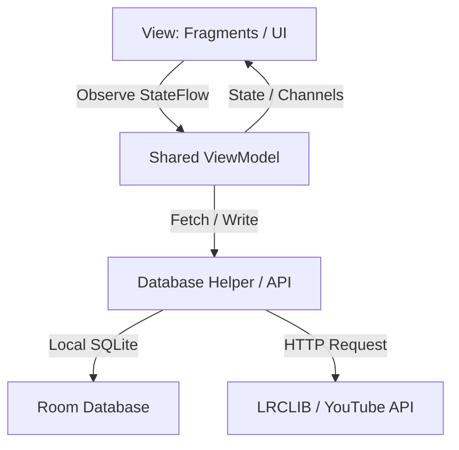

# 🎵 Moozic 🎧

[](https://kotlinlang.org)
[](https://developer.android.com)
[](#)
[](https://developer.android.com/training/data-storage/room)

**Moozic** adalah aplikasi pemutar musik modern berbasis Android yang premium dan kaya fitur. Dibangun menggunakan **Kotlin** dan mengikuti arsitektur **MVVM** (Model-View-ViewModel), Moozic menggabungkan pemutaran lagu online melalui YouTube, pemutar lagu lokal perangkat (ExoPlayer), sinkronisasi lirik otomatis, serta manajemen playlist offline yang cerdas.

---

## 🌟 Fitur Utama (Features)

*   **🔍 Smart Music Search:** Integrasi pencarian lagu secara real-time memanfaatkan YouTube API.
*   **📜 Synchronized Lyrics (LRCLIB):** Fitur lirik berjalan (*Scrolling Lyrics*) otomatis yang mengambil lirik ter-timestamp (`LRC`) dari database LRCLIB, menyoroti baris lagu aktif secara tebal dengan warna aksen (`@color/accent`), dan melakukan gulir halus (*smooth scroll*) otomatis.
*   **🗃️ Offline Playlist Management:** 
    *   Membuat, mengedit, dan menghapus playlist lokal.
    *   Menambahkan lagu hasil pencarian langsung ke playlist yang sudah ada atau membuat playlist baru secara *on-the-fly*.
    *   Sinkronisasi jumlah lagu dalam playlist secara *real-time* di seluruh fragment.
*   **❤️ Favorites & Local Picker:**
    *   Menyimpan lagu online favorit langsung ke database lokal.
    *   Memilih dan memutar file audio lokal (`audio/*`) dari penyimpanan internal perangkat menggunakan file picker terintegrasi.
*   **🎛️ Dynamic Playback Queue:** Sistem antrean pintar di mana tombol Next/Previous dan pemutaran otomatis saat lagu habis akan beralih dinamis sesuai konteks asal lagu diputar (Playlist, daftar Favorit, atau daftar Hasil Pencarian).
*   **📱 Sticky Mini Player:**
    *   Mini player yang melayang di atas Navigation Bar untuk mempermudah kontrol musik cepat (Play/Pause/Stop).
    *   Mendukung transisi interaktif: mengetuk Mini Player akan langsung memperbesar tampilan dan mengalihkan tab aktif ke halaman player utama (`PlayFragment`).
    *   Manajemen layout cerdas: Mini player otomatis disembunyikan saat masuk ke player utama untuk menghindari tumpang tindih visual.

---

## 🛠️ Stack Teknologi (Tech Stack)

*   **Language:** Kotlin (100%)
*   **UI Framework:** XML (Material Component, View Binding)
*   **Navigation:** Jetpack Navigation Component (Single Activity Architecture)
*   **Database (Local):** Room Database (dengan dukungan migrasi schema otomatis)
*   **Asynchronous & Data Stream:** Kotlin Coroutines, Flow (StateFlow, SharedFlow), Channels
*   **Image Loading:** Glide (dengan error handling fallback gambar default)
*   **Media Engine:**
    *   **ExoPlayer (Jetpack Media3):** Untuk pemutaran file audio lokal perangkat.
    *   **YouTube Player Helper:** Untuk streaming video/audio YouTube di latar belakang (*background playback*).

---

## 📂 Struktur Arsitektur (Architecture)

Aplikasi ini menggunakan pola **MVVM** yang bersih dengan Shared ViewModels untuk mengoordinasikan interaksi antar fragment:



*   **`PlayViewModel` (Activity-scoped):** Mengelola siklus hidup media player, antrean lagu (*Playback Queue*), sinkronisasi lirik berjalan, dan status putar lagu.
*   **`PlaylistViewModel` (Activity-scoped):** Mengelola transaksi database Room untuk tabel `playlist_table` dan `playlist_song_table` guna menjamin sinkronisasi hitungan lagu instan antara `PlaylistFragment` (daftar) dan `PlaylistDetailFragment` (rincian).

---

## 🚀 Cara Menjalankan Aplikasi (Getting Started)

1.  Clone repositori ini:
    ```bash
    git clone https://github.com/NuriskiAkbar/Moozic.git
    ```
2.  Buka proyek menggunakan **Android Studio (Ladybug atau yang lebih baru)**.
3.  Pastikan SDK Android API Level 26 ke atas terinstal.
4.  Lakukan sinkronisasi file Gradle (`Gradle Sync`).
5.  Hubungkan perangkat Android fisik atau Emulator.
6.  Klik tombol **Run 'app'** (`Shift + F10`) untuk mulai memainkan musik favorit Anda! 🚀
